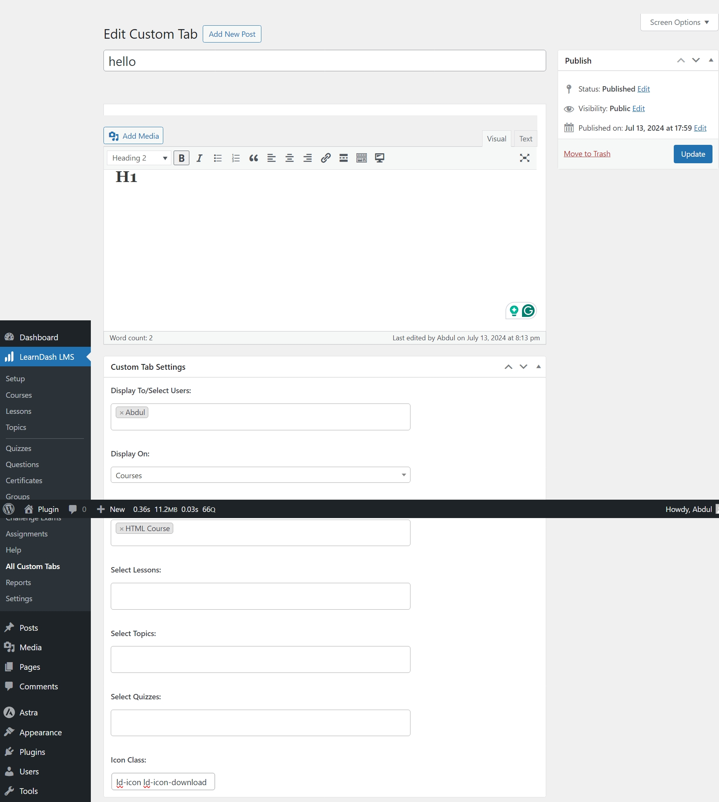

# Learndash Custom Tab Plugin

A plugin for WordPress Website that add features to LearnDash LMS Plugin. It add custom tab on the course page. Custom tab is made by custom post type and has feature to show custom tab on selected courses, quiz, lessons, topics to the selected users. Also has option to add custom icon to the custom tab.

---

# Learndash Custom Tab Plugin



## Table of Contents
- [Introduction](#introduction)
- [Features](#features)
- [Getting Started](#getting-started)
- [Usage](#usage)
- [Contributing](#contributing)
- [License](#license)
- [Live Demo](#live-demo)

## Introduction
The **Learndash Custom Tab Plugin** is a WordPress plugin that enhances the functionality of the LearnDash LMS plugin. It allows administrators to add custom tabs to course pages, quizzes, lessons, and topics. These tabs can be customized to display content to specific users and can include custom icons.

## Features
- Add custom tabs to course pages
- Display custom tabs on selected courses, quizzes, lessons, and topics
- Show custom tabs to selected users
- Add custom icons to custom tabs
- Responsive design for both desktop and mobile devices

## Getting Started
### Prerequisites
- A WordPress website with the LearnDash LMS plugin installed and activated

### Installation
1. Clone the repository:
   ```bash
   git clone https://github.com/Moiz-CodeByte/learndash-custom-tab-plugin.git
   ```
2. Navigate to the plugin directory:
   ```bash
   cd learndash-custom-tab-plugin
   ```
3. Upload the plugin files to the `/wp-content/plugins/` directory, or install the plugin through the WordPress plugins screen directly or download zip via github and upload zip in admin panel.
4. Activate the plugin through the 'Plugins' screen in WordPress.

## Usage
1. Navigate to the LearnDash LMS section in your WordPress dashboard.
2. Create a new custom tab by adding a new custom post type.
3. Select the courses, quizzes, lessons, or topics where you want the custom tab to appear.
4. Assign the custom tab to specific users if needed.
5. Add a custom icon to the tab if desired.

## Contributing
Contributions are welcome! If you have any ideas, suggestions, or improvements, feel free to create a pull request or open an issue.

### Steps to Contribute
1. Fork the repository.
2. Create a new branch:
   ```bash
   git checkout -b feature/your-feature-name
   ```
3. Make your changes and commit them:
   ```bash
   git commit -m "Add your feature"
   ```
4. Push to the branch:
   ```bash
   git push origin feature/your-feature-name
   ```
5. Open a pull request.

### After Opening a Pull Request
1. **Review**: Address any feedback or change requests made by the reviewers.
2. **Approval**: Wait for the pull request to be approved by the maintainers.
3. **Merge**: Once approved, the pull request will be merged by a maintainer.
4. **Close**: The pull request will be closed upon merging. If not merged, it might be closed manually with an explanation.
5. **Cleanup**: Delete your feature branch after the pull request is merged and update your local repository.

## License
This project is open-source and available under the [MIT License](LICENSE).

## Live Demo
You can see the Learndash Custom Tab Plugin live at [Link](https://demo-link.com)

For any questions or support, please contact at [hello@abdulmoiz.net](hello@abdulmoiz.net).


